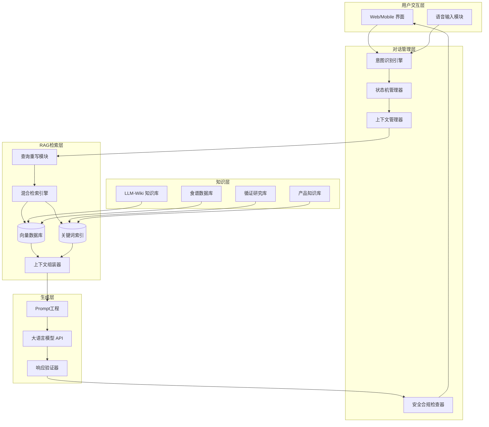
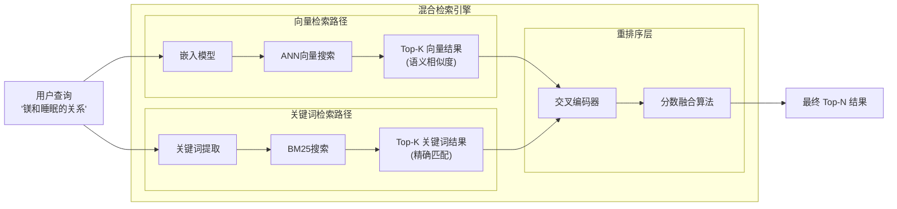
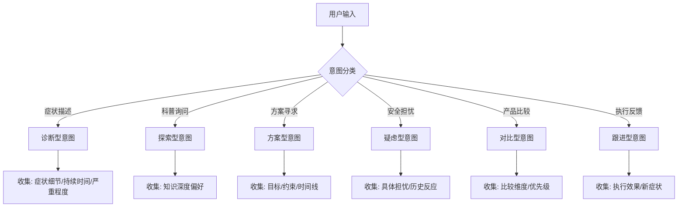
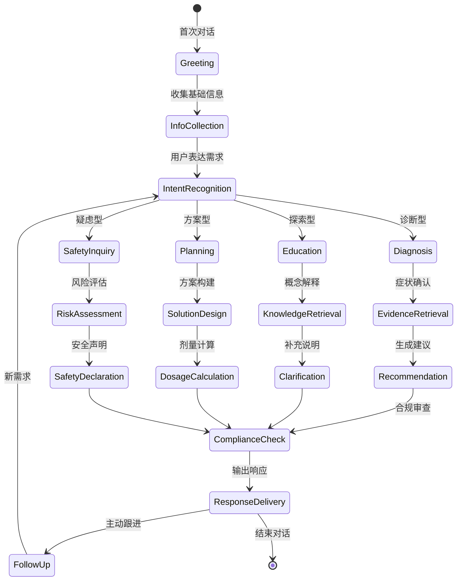
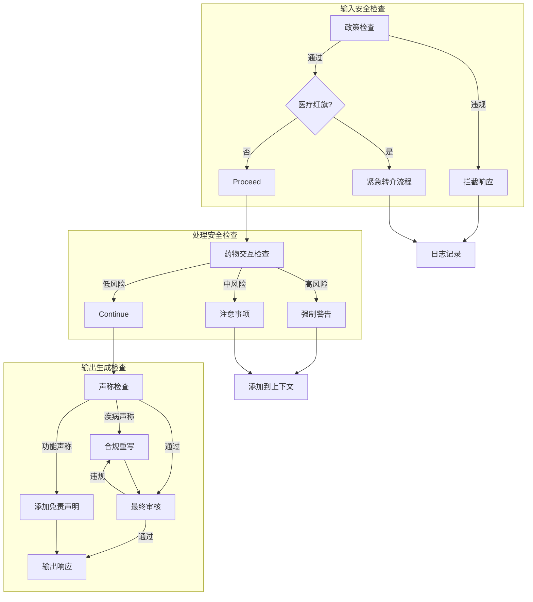
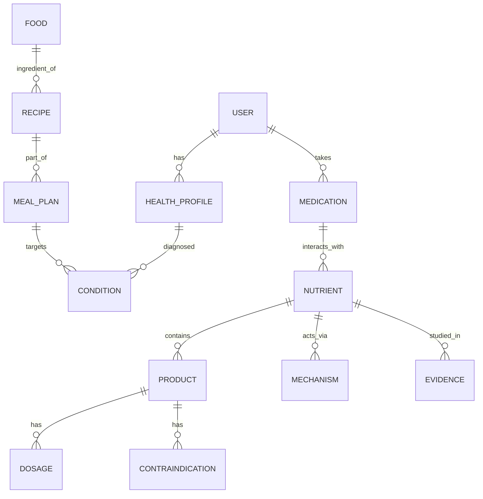

# AI营养师对话系统技术架构设计

> **任务编号**: REQ-20250424-005-T2-002  
> **所属项目**: Hermes Knowledge System Phase 2  
> **版本**: v1.0.0  
> **日期**: 2025-04-23

---

## 执行摘要

本文档定义了面向合成生物学公司的AI营养师对话系统的完整技术架构，支持AKK益生菌、镁补充剂等精准营养产品的智能咨询服务。架构核心包含两大支柱：

1. **RAG（检索增强生成）知识检索系统** - 整合LLM-Wiki营养知识库与实时食谱数据
2. **对话流程状态机** - 管理用户意图识别、多轮对话与安全合规检查

---

## 一、系统总体架构

### 1.1 架构概览



### 1.2 数据流架构

```
┌─────────────────────────────────────────────────────────────────────────────┐
│                         AI营养师对话系统数据流                                 │
├─────────────────────────────────────────────────────────────────────────────┤
│                                                                              │
│   用户输入 ──→ 意图识别 ──→ 状态机 ──→ 知识检索 ──→ 上下文组装 ──→ LLM生成    │
│      │           │           │           │            │            │       │
│      │           ↓           ↓           ↓            ↓            ↓       │
│      │      [诊断型]    [咨询中]    [向量+关键词]   [循证+食谱]   [合规检查] │
│      │      [探索型]    [收集信息]   [混合检索]    [个性化]     [安全声明]   │
│      │      [方案型]    [推荐中]    [Rerank]      [剂量计算]   [边界审核]   │
│      │      [疑虑型]    [跟进中]    [过滤]        [禁忌检查]   [输出]      │
│      │                                                                      │
│      └────────────────←←←←←← 对话历史 ←←←←←←←←←←←←←←←←←←←←←←─────────────┤
│                                                                              │
└─────────────────────────────────────────────────────────────────────────────┘
```

---

## 二、RAG知识检索架构

### 2.1 知识库结构设计 (LLM-Wiki)

```
llm-wiki/
├── entities/                    # 实体知识库
│   ├── nutrients/               # 营养素实体
│   │   ├── magnesium.md        # 镁 - 形式/剂量/机制/交互
│   │   ├── akkermansia.md      # AKK菌 - 菌株/研究/功效
│   │   ├── probiotics.md       # 益生菌通用
│   │   └── vitamins/           # 维生素家族
│   ├── products/               # 产品实体
│   │   ├── akk-wst01.md       # AKK WST01 产品档案
│   │   ├── mag-glycinate.md  # 甘氨酸镁产品
│   │   └── [SKU档案模板]
│   ├── conditions/             # 健康状况
│   │   ├── constipation.md    # 便秘 - 营养干预
│   │   ├── sleep-disorder.md  # 睡眠障碍
│   │   ├── metabolic-syndrome.md
│   │   └── [疾病档案模板]
│   └── foods/                  # 食物实体
│       └── [从chestnutmates导入]
│
├── concepts/                    # 概念知识库
│   ├── mechanisms/             # 作用机制
│   │   ├── gut-barrier.md     # 肠屏障机制
│   │   ├── gaba-pathway.md    # GABA通路
│   │   └── magnesium-absorption.md
│   ├── protocols/              # 干预方案
│   │   ├── sleep-protocol.md  # 睡眠改善方案
│   │   ├── weight-management.md
│   │   └── [方案模板]
│   └── evidence/               # 循证等级
│       ├── rct-reviews.md     # RCT荟萃分析
│       ├── animal-studies.md  # 动物研究标注
│       └── clinical-trials.md # 临床试验
│
├── comparisons/                 # 对比知识库
│   ├── magnesium-forms.md     # 镁形式对比
│   ├── probiotic-strains.md   # 菌株对比
│   └── akk-live-vs-pasteurized.md
│
├── raw/                        # 原始数据源
│   ├── chestnutmates-recipes/ # 食谱数据
│   ├── research-papers/       # 研究论文
│   └── product-inserts/       # 产品说明书
│
└── schema/                     # 元数据与模式
    ├── entity-schema.json     # 实体结构定义
    ├── relation-schema.json   # 关系定义
    └── embedding-config.yaml  # 向量化配置
```

### 2.2 文档分块策略 (Chunking Strategy)

| 文档类型 | 分块大小 | 重叠 | 策略说明 |
|---------|---------|------|---------|
| 营养素实体 | 512 tokens | 50 tokens | 按语义段落（机制/剂量/交互）分割 |
| 产品档案 | 384 tokens | 30 tokens | 结构化字段独立分块 |
| 研究证据 | 1024 tokens | 100 tokens | 保持研究上下文完整性 |
| 食谱数据 | 256 tokens | 20 tokens | 按餐次/食材分割，便于精确检索 |
| 健康方案 | 768 tokens | 80 tokens | 按阶段/步骤分割 |

### 2.3 混合检索策略



#### 检索权重配置

```yaml
# retrieval_config.yaml
retrieval:
  vector:
    weight: 0.6
    top_k: 20
    similarity_threshold: 0.75
    
  keyword:
    weight: 0.4
    top_k: 15
    boost_fields:
      - field: title
        boost: 3.0
      - field: tags
        boost: 2.0
      - field: content
        boost: 1.0
        
  rerank:
    model: cross-encoder/ms-marco-MiniLM-L-6-v2
    top_n: 8
    
  fusion:
    method: reciprocal_rank_fusion  # RRF算法
    k: 60  # RRF常数
```

### 2.4 上下文组装策略

```python
# 上下文组装逻辑示意
class ContextAssembler:
    def assemble(self, query, user_profile, retrieved_chunks):
        context_parts = {
            # 1. 系统角色定义 (固定)
            "system_role": self.get_role_definition(),
            
            # 2. 用户画像上下文
            "user_context": {
                "demographics": user_profile.age_gender,
                "health_conditions": user_profile.conditions,
                "medications": user_profile.medications,
                "dietary_restrictions": user_profile.dietary_prefs,
                "conversation_history": self.get_recent_turns(5)
            },
            
            # 3. 循证知识 (按证据等级排序)
            "evidence_base": self.filter_by_evidence_level(
                retrieved_chunks, 
                min_level="RCT"
            ),
            
            # 4. 产品知识 (仅当相关)
            "product_info": self.filter_product_chunks(
                retrieved_chunks,
                relevance_threshold=0.8
            ),
            
            # 5. 食谱数据 (如用户询问饮食)
            "recipe_suggestions": self.get_relevant_recipes(
                query, user_profile
            ),
            
            # 6. 安全交互检查
            "safety_flags": self.check_interactions(
                user_profile.medications,
                retrieved_chunks
            )
        }
        
        return self.format_for_llm(context_parts)
```

### 2.5 上下文优先级排序

| 优先级 | 内容类型 | 理由 |
|-------|---------|------|
| P0 | 安全交互警告 | 药物-营养素交互必须优先展示 |
| P1 | 循证机制解释 | 用户核心问题答案 |
| P2 | 剂量与方案建议 | 可执行的具体建议 |
| P3 | 产品信息 | 仅当用户明确询问或匹配需求 |
| P4 | 食谱推荐 | 生活方式干预支持 |
| P5 | 研究局限声明 | 不确定性透明 |

---

## 三、对话流程状态机

### 3.1 用户意图分类体系



#### 意图分类特征

| 意图类型 | 关键词模式 | 信息需求 | 响应策略 |
|---------|-----------|---------|---------|
| **诊断型** | "便秘怎么办" "胃痛" "睡不着" | 症状细节、持续时间、伴随症状 | 三级追问 → 循证建议 |
| **探索型** | "AKK菌是什么" "镁有什么作用" | 知识深度、科学背景兴趣 | 机制解释 → 证据分级 |
| **方案型** | "我想改善睡眠" "怎么减肥" | 目标定义、约束条件、时间预期 | 结构化行动计划 |
| **疑虑型** | "有副作用吗" "安全吗" "和XX药冲突吗" | 具体担忧、用药史、过敏史 | 安全声明 → 文献引用 |
| **对比型** | "有什么区别" "哪个更好" | 比较维度、使用场景、预算 | 客观对比矩阵 |
| **跟进型** | "吃了几天感觉" "接下来怎么办" | 执行情况、主观感受、新症状 | 效果评估 → 方案调整 |

### 3.2 对话状态机设计



#### 状态定义与转换条件

```python
# 对话状态定义
class DialogState(Enum):
    GREETING = "greeting"           # 开场白
    INFO_COLLECTION = "info_collection"  # 收集用户档案
    INTENT_RECOGNITION = "intent_recognition"  # 意图识别
    
    # 专业处理状态
    DIAGNOSIS = "diagnosis"         # 症状分析
    EVIDENCE_RETRIEVAL = "evidence_retrieval"  # 证据检索
    KNOWLEDGE_RETRIEVAL = "knowledge_retrieval"  # 知识检索
    SOLUTION_DESIGN = "solution_design"  # 方案设计
    RISK_ASSESSMENT = "risk_assessment"  # 风险评估
    
    # 安全检查状态
    INTERACTION_CHECK = "interaction_check"  # 药物交互检查
    COMPLIANCE_CHECK = "compliance_check"    # 合规审查
    SAFETY_DECLARATION = "safety_declaration"  # 安全声明
    
    # 输出与跟进
    RESPONSE_DELIVERY = "response_delivery"  # 响应输出
    FOLLOW_UP = "follow_up"         # 跟进对话
    
    # 终止状态
    EMERGENCY_REFERRAL = "emergency_referral"  # 紧急转介
    COMPLETION = "completion"         # 正常结束

# 状态转换规则
TRANSITIONS = {
    DialogState.GREETING: [DialogState.INFO_COLLECTION],
    DialogState.INFO_COLLECTION: [DialogState.INTENT_RECOGNITION],
    DialogState.INTENT_RECOGNITION: [
        DialogState.DIAGNOSIS,
        DialogState.KNOWLEDGE_RETRIEVAL, 
        DialogState.SOLUTION_DESIGN,
        DialogState.RISK_ASSESSMENT
    ],
    DialogState.DIAGNOSIS: [DialogState.EVIDENCE_RETRIEVAL, DialogState.EMERGENCY_REFERRAL],
    DialogState.EVIDENCE_RETRIEVAL: [DialogState.SOLUTION_DESIGN, DialogState.INTERACTION_CHECK],
    DialogState.SOLUTION_DESIGN: [DialogState.INTERACTION_CHECK, DialogState.DOSAGE_CALCULATION],
    DialogState.INTERACTION_CHECK: [DialogState.SAFETY_DECLARATION, DialogState.COMPLIANCE_CHECK],
    DialogState.SAFETY_DECLARATION: [DialogState.COMPLIANCE_CHECK],
    DialogState.COMPLIANCE_CHECK: [DialogState.RESPONSE_DELIVERY, DialogState.EMERGENCY_REFERRAL],
    DialogState.RESPONSE_DELIVERY: [DialogState.FOLLOW_UP, DialogState.COMPLETION],
    DialogState.FOLLOW_UP: [DialogState.INTENT_RECOGNITION, DialogState.COMPLETION]
}
```

### 3.3 多轮对话上下文管理

```
┌─────────────────────────────────────────────────────────────────────────────┐
│                         对话上下文数据结构                                   │
├─────────────────────────────────────────────────────────────────────────────┤
│                                                                              │
│  session_context = {                                                         │
│      session_id: "uuid",                                                     │
│      created_at: timestamp,                                                  │
│      user_profile: {                                                         │
│          demographics: {age, gender, height, weight},                       │
│          health_conditions: [...],                                           │
│          medications: [...],                                                 │
│          dietary_restrictions: [...],                                        │
│          goals: [...]                                                        │
│      },                                                                      │
│      conversation_history: [                                                 │
│          {role: "user", content: "...", intent: "...", timestamp: ...},    │
│          {role: "assistant", content: "...", retrieved_sources: [...]},      │
│          ...                                                                 │
│      ],                                                                      │
│      current_state: "diagnosis",                                            │
│      pending_questions: [...],  # 待追问列表                                │
│      collected_info: {  # 已收集信息                                         │
│          symptoms: {...},                                                    │
│          duration: "...",                                                    │
│          severity: 1-10                                                      │
│      },                                                                      │
│      safety_flags: [  # 累积的安全警告                                       │
│          {type: "drug_interaction", severity: "high", details: {...}},      │
│          ...                                                                 │
│      ],                                                                      │
│      recommendations_given: [...],  # 已给出的建议                            │
│      follow_up_scheduled: timestamp                                          │
│  }                                                                           │
│                                                                              │
└─────────────────────────────────────────────────────────────────────────────┘
```

### 3.4 安全边界与合规检查节点



#### 合规检查清单 (每条回复)

| 检查节点 | 检查内容 | 违规处理 |
|---------|---------|---------|
| **医疗红旗识别** | 急性症状(血便/胸痛/持续呕吐) | 立即转人工/建议就医 |
| **药物交互检查** | 用户用药与推荐营养素交互 | 强制添加交互警告 |
| **疾病声称过滤** | "治疗/治愈/疗程"等医疗术语 | 重写为功能声称 |
| **证据等级标注** | 是否区分强/弱证据 | 补充不确定性声明 |
| **剂量安全边界** | 推荐剂量是否超UL | 调整至安全范围 |
| **特殊人群检查** | 孕哺/儿童/免疫缺陷警示 | 添加特定人群警告 |
| **地理合规适配** | 中美法规差异 | 按用户位置切换表述 |

---

## 四、技术选型建议

### 4.1 Embedding模型选择

| 候选模型 | 维度 | 多语言 | 领域适配 | 推荐场景 | 部署成本 |
|---------|------|--------|---------|---------|---------|
| **text-embedding-3-large (OpenAI)** | 3072 | ✅ | 通用 | 高精度需求 | $$$ |
| **BGE-M3 (BAAI)** | 1024 | ✅ | 中英优化 | 中美部署首选 | $ |
| **gte-large-zh (Alibaba)** | 1024 | ✅ | 中文优化 | 中国部署 | $ |
| **m3e-base (MokaAI)** | 768 | ✅ | 中文领域 | 中文RAG | $ |
| **bge-large-en-v1.5** | 1024 | ❌ | 英文优化 | 文献检索 | $ |

**推荐决策**:
- **中美两地部署**: BGE-M3 (单一模型支持中英混合查询)
- **成本敏感场景**: gte-large-zh (中国) + all-MiniLM-L6-v2 (美国)
- **最高精度**: text-embedding-3-large (需考虑API成本)

### 4.2 向量数据库选择

| 数据库 | 混合检索 | 云原生 | 开源 | 推荐指数 | 适用场景 |
|--------|---------|-------|------|---------|---------|
| **Milvus/Zilliz** | ✅ | ✅ | ✅ | ⭐⭐⭐⭐⭐ | 大规模生产部署 |
| **Weaviate** | ✅ | ✅ | ✅ | ⭐⭐⭐⭐ | 多模态/GraqphQL |
| **Qdrant** | ✅ | ✅ | ✅ | ⭐⭐⭐⭐ | Rust生态/高性能 |
| **Pinecone** | ✅ | ✅ | ❌ | ⭐⭐⭐ | 快速启动/托管 |
| **pgvector** | ⚠️ | ✅ | ✅ | ⭐⭐⭐ | 简单场景/已用PG |
| **Chroma** | ⚠️ | ⚠️ | ✅ | ⭐⭐ | 开发测试 |

**推荐决策**:
- **生产环境**: Milvus (成熟的企业级功能，混合检索原生支持)
- **快速验证**: Chroma → 后续迁移到Milvus
- **已有PostgreSQL**: pgvector (降低运维复杂度)

### 4.3 LLM API选择

| 供应商 | 推荐模型 | 中文能力 | 推理成本 | 合规备案 | 部署建议 |
|--------|---------|---------|---------|---------|---------|
| **OpenAI** | GPT-4o / o3-mini | ⭐⭐⭐⭐ | $$$ | 中国❌ | 美国部署 |
| **Anthropic** | Claude 3.5 Sonnet | ⭐⭐⭐⭐⭐ | $$$ | 中国❌ | 美国高端场景 |
| **阿里云** | Qwen2.5-72B / Qwen-Max | ⭐⭐⭐⭐⭐ | $$ | ✅ | 中国首选 |
| **月之暗面** | Kimi k1.5 | ⭐⭐⭐⭐⭐ | $$ | ✅ | 中国长文本场景 |
| **DeepSeek** | DeepSeek-V3 / R1 | ⭐⭐⭐⭐ | $ | ✅ | 性价比首选 |
| **智谱AI** | GLM-4 | ⭐⭐⭐⭐ | $$ | ✅ | 中国备选 |
| **Google** | Gemini 2.0 Pro | ⭐⭐⭐⭐ | $$ | 中国❌ | 美国/全球 |

**中美两地部署策略**:

```yaml
# llm_routing.yaml
routing:
  china:
    primary: "qwen-max"      # 阿里通义
    fallback: "deepseek-v3"   # 深度求索
    backup: "glm-4"          # 智谱
    
  us_global:
    primary: "gpt-4o"
    fallback: "claude-3-5-sonnet"
    backup: "gemini-2.0-pro"
    
  routing_logic:
    - detect_user_location  # IP/设置识别
    - apply_regulatory_filter  # 合规过滤
    - route_to_regional_llm
    - fallback_on_rate_limit
```

### 4.4 重排序模型选择

| 模型 | 大小 | 效果 | 延迟 | 推荐 |
|------|-----|------|------|------|
| **cross-encoder/ms-marco-MiniLM-L-6-v2** | 22MB | ⭐⭐⭐⭐ | 低 | ⭐⭐⭐⭐⭐ 首选 |
| **BAAI/bge-reranker-base** | 400MB | ⭐⭐⭐⭐⭐ | 中 | ⭐⭐⭐⭐ 中文优化 |
| **cohere-rerank-v3** | API | ⭐⭐⭐⭐⭐ | API延迟 | ⭐⭐⭐ 托管方案 |

---

## 五、推荐工具链清单

### 5.1 核心框架与库

| 类别 | 工具 | 版本 | 用途 |
|------|------|------|------|
| **RAG框架** | LangChain / LlamaIndex | latest | 检索流程编排 |
| **向量DB** | Milvus + pymilvus | 2.3+ | 向量存储与检索 |
| **关键词索引** | Elasticsearch / OpenSearch | 8.x | BM25检索 |
| **嵌入模型** | sentence-transformers | 2.3+ | 本地模型加载 |
| **重排序** | FlagEmbedding (BGE) | latest | 结果精排 |
| **LLM SDK** | openai / anthropic / dashscope | latest | 模型调用 |
| **工作流** | Prefect / Airflow | 2.x | 数据管道 |

### 5.2 数据管道工具

| 工具 | 用途 | 说明 |
|------|------|------|
| **Apache Airflow** | ETL编排 | 食谱数据定期同步 |
| **chestnutmates-skill** | 食谱抓取 | 已开发的数据源 |
| **unstructured** | 文档解析 | PDF/Word研究论文处理 |
| **Marker** | PDF转Markdown | 学术论文结构化 |

### 5.3 监控与评估

| 工具 | 用途 |
|------|------|
| **LangSmith / Langfuse** | 对话追踪与评估 |
| **Ragas** | RAG效果评估框架 |
| **Evidently** | 数据漂移检测 |
| **Prometheus + Grafana** | 系统监控 |

### 5.4 部署与基础设施

| 组件 | 中国部署 | 美国部署 |
|------|---------|---------|
| **容器编排** | 阿里云ACK / 华为云CCE | AWS EKS / GKE |
| **向量数据库** | Zilliz Cloud (阿里云) | Zilliz Cloud / Pinecone |
| **LLM API** | 阿里云百炼 / 月之暗面 | OpenAI / Anthropic |
| **对象存储** | 阿里云OSS | AWS S3 |
| **缓存** | 阿里云Redis | ElastiCache |

---

## 六、架构决策的Trade-off分析

### 6.1 检索策略权衡

| 策略 | 优势 | 劣势 | 适用场景 |
|------|-----|------|---------|
| **纯向量检索** | 语义理解强，容错性好 | 关键词精确度低，冷启动难 | 开放域问答 |
| **纯关键词检索** | 精确匹配，可解释 | 无法理解语义，同义词难处理 | 产品名/剂量查询 |
| **混合检索 (推荐)** | 兼顾语义与精确，召回率高 | 复杂度增加，需要调参 | 营养咨询场景 |
| **GraphRAG** | 关系推理强 | 构建成本高，查询复杂 | 复杂交互推理 |

### 6.2 知识库更新策略

| 策略 | 实时性 | 一致性 | 成本 | 推荐 |
|------|-------|-------|------|------|
| **批量更新 (日/周)** | 低 | 高 | 低 | 基础营养知识 |
| **近实时更新 (小时)** | 中 | 中 | 中 | 食谱数据 |
| **实时更新** | 高 | 低 | 高 | 不推荐 |
| **增量更新 + 版本控制** | 中 | 高 | 中 | ⭐ 推荐方案 |

### 6.3 对话状态管理

| 方案 | 可解释性 | 灵活性 | 开发成本 | 推荐 |
|------|---------|--------|---------|------|
| **规则状态机** | ⭐⭐⭐⭐⭐ | ⭐⭐ | 中 | 核心安全流程 |
| **LLM驱动状态** | ⭐⭐ | ⭐⭐⭐⭐⭐ | 低 | 辅助决策 |
| **混合方案 (推荐)** | ⭐⭐⭐⭐ | ⭐⭐⭐⭐ | 中 | 安全边界+灵活对话 |

---

## 七、实施路线图

### Phase 1: MVP验证 (4-6周)
- [ ] 搭建Milvus + BGE-M3基础RAG
- [ ] 实现核心意图识别 (4类主要意图)
- [ ] 集成1个LLM (DeepSeek-V3 或 GPT-4o-mini)
- [ ] 完成基础安全合规检查
- [ ] 导入chestnutmates食谱数据

### Phase 2: 功能完善 (4-6周)
- [ ] 实现混合检索 (向量+关键词)
- [ ] 添加交叉编码器重排序
- [ ] 完善6类意图全覆盖
- [ ] 实现对话状态机核心流程
- [ ] 添加药物交互检查

### Phase 3: 生产优化 (4周)
- [ ] 中美双区域部署
- [ ] 实现Ragas评估流水线
- [ ] 添加A/B测试框架
- [ ] 完善监控告警体系
- [ ] 性能优化 (缓存/预计算)

### Phase 4: 持续迭代 (长期)
- [ ] 用户反馈闭环
- [ ] 知识库自动更新
- [ ] 多语言支持扩展
- [ ] 个性化推荐增强

---

## 八、附录

### A. 数据实体关系图



### B. 检索查询示例

```python
# 示例: 用户查询"镁和睡眠的关系"的检索流程

# 1. 查询分析
query = "镁和睡眠的关系"
expanded_queries = [
    "镁对睡眠质量的影响机制",
    "甘氨酸镁改善失眠的临床研究",
    "镁补充剂与GABA受体的关系"
]

# 2. 向量检索
vector_results = vector_db.search(
    query_embedding=embed(query),
    filter={"category": ["mechanisms", "evidence"]},
    top_k=10
)

# 3. 关键词检索
keyword_results = keyword_db.search(
    query="镁 AND (睡眠 OR 失眠 OR 睡眠质量) AND (机制 OR 研究)",
    fields=["title^3", "content", "tags^2"],
    top_k=10
)

# 4. 结果融合
fused_results = reciprocal_rank_fusion(
    [vector_results, keyword_results],
    k=60
)

# 5. 重排序
reranked = cross_encoder.rerank(
    query=query,
    documents=fused_results,
    top_n=5
)

# 6. 上下文组装
context = {
    "mechanism": reranked[0],  # 镁通过GABA改善睡眠
    "evidence": reranked[1],     # 甘氨酸镁RCT研究
    "dosage": reranked[2],       # 300-400mg推荐剂量
    "products": reranked[3],     # 相关产品信息
    "safety": reranked[4]        # 与降压药交互警告
}
```

### C. 相关资源链接

- [Karpathy AI营养师对话规范](./karpathy-skills/expert-nutritionist-ai.md)
- [chestnutmates食谱抓取技能](./hermes-skills/chestnutmates-nutrition-enhanced/SKILL.md)
- [LLM-Wiki知识库](./llm-wiki/)

---

*文档结束*
